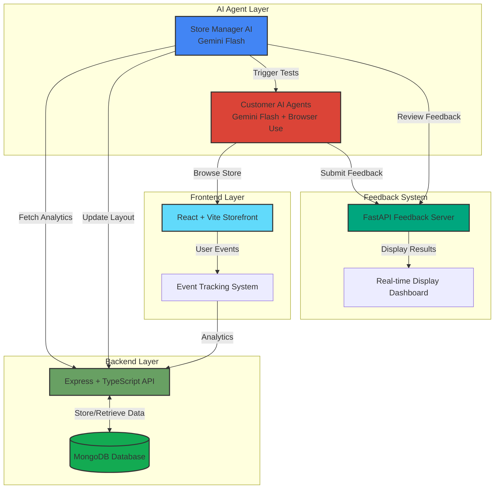

<div align="center">


[](https://devpost.com/software/halt-y8jwon?ref_content=user-portfolio&ref_feature=in_progress)
[](https://www.halt-hack.tech/)
[](https://uofthacks-13.devpost.com/)

### Weeks of A/B testing, compressed into minutes — by AI shoppers, not real ones.

[**Try the Live Demo**](https://www.halt-hack.tech/) &nbsp;•&nbsp; [**Read the Devpost**](https://devpost.com/software/halt-y8jwon) &nbsp;•&nbsp; [**Report a Bug**](https://github.com/leungt30/HALT/issues)

</div>

<br/>

## What is HALT?

**HALT** is an AI-powered e-commerce optimization platform. Instead of running a real A/B test for weeks, HALT spins up a swarm of autonomous **AI customer agents**, each with a distinct persona — budget-conscious, tech-savvy, quick-buyer, browser, and more — and sets them loose on your store. They shop, click, scroll, and report back. A **Store Manager AI** reads their feedback, rewrites the layout, and reruns the test — closing the loop automatically.

Companies spend an estimated **$1.5 billion a year** on A/B testing in the US alone, and even a 0.1% lift in engagement can mean six figures in revenue. HALT exists to make that iteration loop near-instant.

<br/>

<div align="center">



</div>

<br/>

## How It Works

1. **Store Manager analyzes** — pulls customer event data (bounce rates, category engagement, scroll depth) from MongoDB and spots optimization opportunities.
2. **Layout proposal** — the agent generates a new layout hypothesis, reorganizing categories, products, and promotional content via the backend API.
3. **Customer simulation** — 10 AI personas are spawned, each with its own goals (quick purchase vs. browsing, budget-conscious vs. feature-focused, tech-savvy vs. low technical skill), and use Browser Use to shop the storefront naturally.
4. **Feedback collection** — each agent reports back on shopping experience, ease of finding products, layout intuitiveness, and visual appeal, aggregated live on the dashboard.
5. **Iteration** — the Store Manager reviews the results and proposes a refined layout, repeating the cycle.

<br/>

## Features

| | |
|---|---|
| 🤖 **Autonomous AI Agents** | A Store Manager agent that optimizes layouts, plus 10 unique customer personas that simulate realistic shopping behavior |
| 📊 **Real-Time Analytics** | Every interaction, browse, and purchase is logged to MongoDB and surfaced on a live dashboard |
| 🎨 **Dynamic Store Layouts** | AI-driven category organization on a responsive React storefront that updates as feedback comes in |
| 🔄 **Continuous Optimization Loop** | Manager proposes → agents test → feedback collected → manager iterates, fully automated |

<br/>

## Tech Stack

<div align="center">

**Frontend**


**Backend**


**AI Agents**


**Deployment**


</div>

<br/>

<details>
<summary><b>Run it locally</b></summary>
<br/>

HALT is 4 services: `backend` (Express API), `frontend` (React storefront), `customer-ai-agent` (FastAPI, spawns shopper simulations), and `store-manager-ai` (the optimization loop). You'll need Node 18+, Python 3.9+, a MongoDB instance, a Gemini API key, and Playwright browsers installed.

```bash
git clone https://github.com/leungt30/HALT.git && cd HALT

python -m venv .venv && source .venv/bin/activate
pip install -r requirements.txt && playwright install

cd frontend && npm install && cd ../backend && npm install && cd ..
```

Set `MONGODB_URI` in `backend/.env`, and `GEMINI_API_KEY` in `store-manager-ai/.env` and `customer-ai-agent/.env`, then run each service (`npm run dev` for frontend/backend, `uvicorn server:app` for the agent server, `python agent.py` for the store manager) — or use the bundled orchestration script:

```bash
./run_optimization_loop.sh
```

This starts the feedback dashboard, launches the customer agent service, and kicks off the Store Manager's optimization loop end to end.

</details>

<br/>

## Challenges & What We Learned

Getting multiple autonomous agents to reliably talk to each other was the hard part — designing how events get collected, stored, and retrieved; making sure the storefront tracked metrics the Store Manager could actually act on; and synchronizing the full loop (manager → backend → customer agents → browsing → events → feedback → manager again). None of us had built agentic architecture before, so a lot of the early iterations just taught us how much data the manager actually needed to make good decisions.

We came away with a much better sense of system design for autonomous, cooperating components, agentic prompt engineering (very different from conversational prompting), and how to build event pipelines that produce genuinely actionable signals.

<br/>

## Roadmap

- **Personalization** — in-session recommendations, richer event tracking, adaptive suggestions
- **Advanced store management** — promotions the Store Manager can create and test, trend research, side-by-side A/B comparisons
- **Enterprise** — custom persona creation, multi-store support, integrations with Shopify/WooCommerce

<br/>

## Team

Built at **UofTHacks 13**.

<div align="center">
<table>
  <tr>
    <td align="center">
      <a href="https://devpost.com/leungt30">
        <br />
        <b>Timothy Leung</b>
      </a><br />
      <sub>CS @ Mac</sub>
    </td>
    <td align="center">
      <a href="https://devpost.com/loicwedji">
        <br />
        <b>Loic Wedji</b>
      </a><br />
      <sub>CS @ Brock</sub>
    </td>
    <td align="center">
      <a href="https://devpost.com/hilaryhe1012">
        <br />
        <b>Hilary He</b>
      </a><br />
      <sub>DevOps @ RBC | CS @ Mac</sub>
    </td>
    <td align="center">
      <a href="https://devpost.com/alaqmargandhi">
        <br />
        <b>Alaqmar Gandhi</b>
      </a><br />
      <sub>DevOps @ RBC | CS @ BrockU</sub>
    </td>
  </tr>
</table>
</div>

<br/>

<div align="center">

Created for **UofTHacks 13** — see the repository for license details.

[](https://devpost.com/software/halt-y8jwon?ref_content=user-portfolio&ref_feature=in_progress)


</div>
